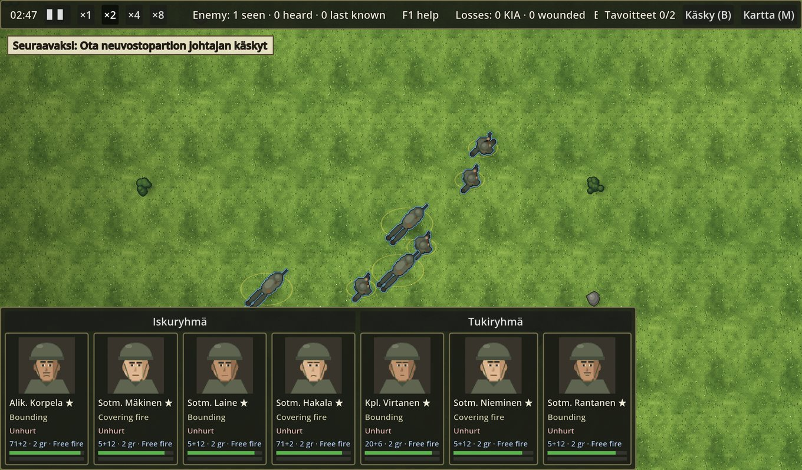
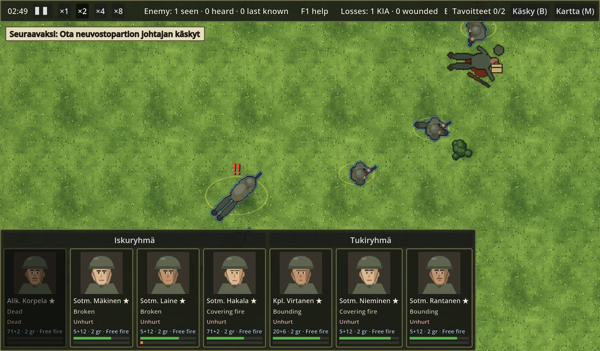
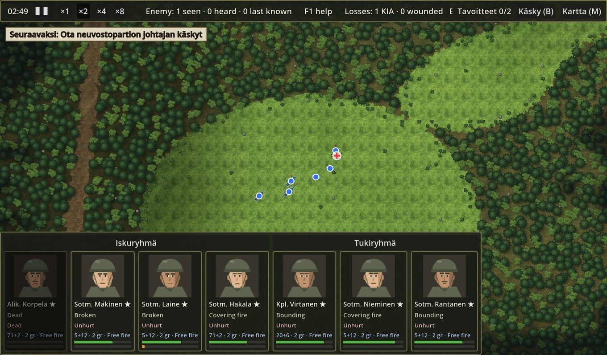
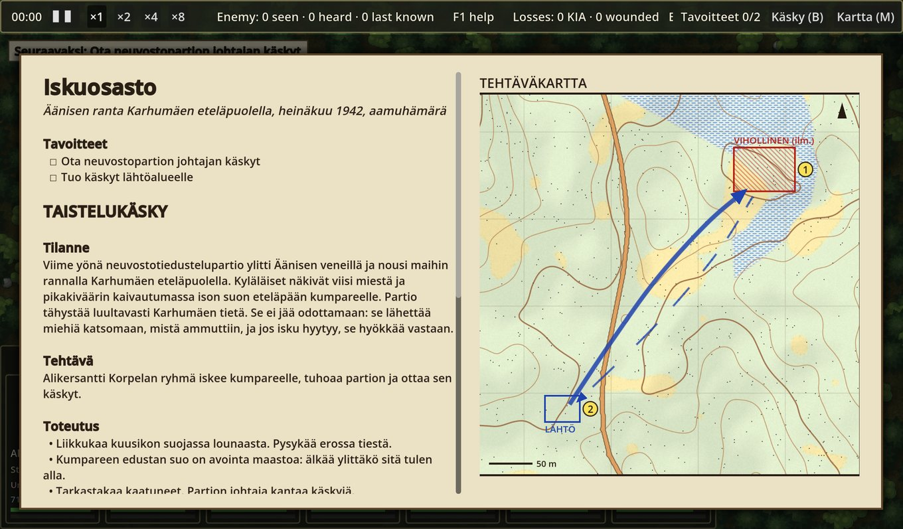
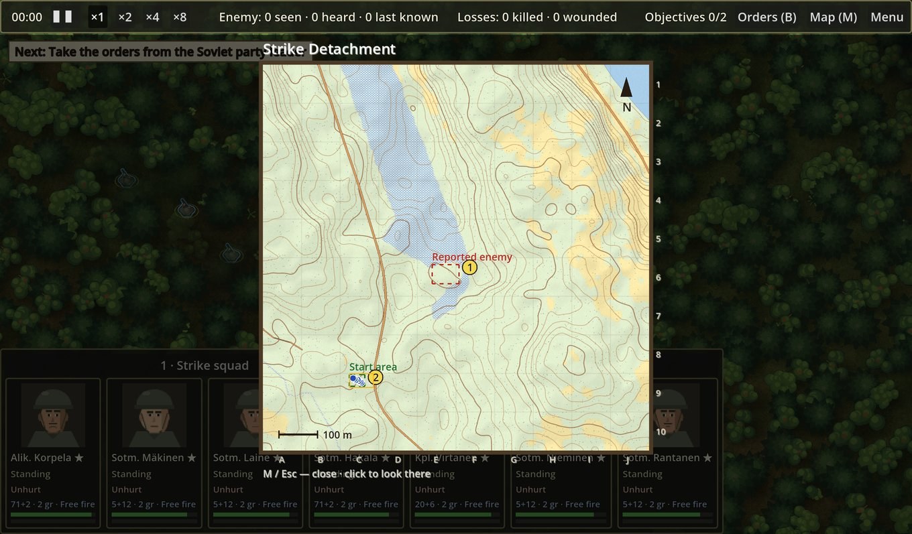

# No Man's Forest

**A free, open-source WW2 squad tactics game set in the Finnish Continuation War, 1942.**
Real-time squad fighting in the spirit of *Close Combat*, men with names and nerves as in *Jagged Alliance 2*,
leadership and morale as in *Squad Leader* — on a kilometre of real Karelian terrain.



[English](#english) · [Suomeksi](#suomeksi)

---

## English

### The game

You command a Finnish platoon of two squads — Alik. Korpela's strike squad and Kpl. Virtanen's support squad
with its Lahti-Saloranta machine gun — against a Soviet reconnaissance party dug in on a knoll south of
Karhumäki, on the Lake Onega shore, at dawn in July 1942. Take the Soviet leader's orders and bring them back.

You don't micromanage: **click where to go, and the men do their best.** They pick their pace, take cover, fire
back, drop prone when bullets crack past, get pinned or break, and are rallied by their leaders.

- **Attack by fire and movement.** Double click an enemy: half the men dash 25 m to cover while the other half
  keep his head down, in turns; close in on a suppressed enemy they finish with grenades and bayonets.
- **Area fire.** Ctrl/Cmd + click, or click a "?" where an enemy was last seen or heard: keep his position under
  fire even when you cannot see him.
- **Men, not units.** Every man has nerve, morale, marksmanship, experience and (for leaders) leadership.
  Veterans move harder to hit and see the moment to go in; the toughest (★) hold their ground under fire.
- **An enemy that thinks.** The Soviet commander scouts where he hears shots, holds his post, and counterattacks
  with his reserve when your attack falters — his "Urraa!" is heard across the woods.
- **Fog of war.** You only see what your men see; heard movement shows as a "?", last-known positions linger.
- **Real terrain.** The map is 1 km × 1 km of real ground (OpenStreetMap and ASTER elevation), with bogs, spruce
  forest, boulders and a knoll, changed a little to look like 1942.
- **Ballistics, not dice.** Every bullet flies: cover stops it, the ground stops it, a miss close by suppresses.
- **Deterministic.** The simulation is integer-only and replays exactly from its order log.

| | |
|---|---|
|  |  |
| *The fight at close range: cards show what every man is doing.* | *Zoomed far out: men as markers, fire and hits as signals.* |
|  |  |
| *The orders, with the attack and withdrawal routes.* | *The map of the area: what your men know.* |

### Quick start

You need the [.NET 10 SDK](https://dotnet.microsoft.com/download) and [Godot 4.7 .NET](https://godotengine.org/download)
(`brew install --cask godot-mono` on macOS; on Windows or Linux download the ".NET" build and set `GODOT` to its
executable).

```bash
git clone https://github.com/trotor/no-mans-forest.git
cd no-mans-forest
tools/run_game.sh                  # play (mission texts in English)
tools/run_game.sh -- --lang=fi     # mission texts in Finnish
```

Other options: `--window=1280x800`, `--zoom=0.5`, `--look=466,552` (camera on a point, metres), `--reveal` (show everything), `--map=skirmish` (a bare map without a mission),
`--demo` (everyone marches to the map centre), `--demo=attack` (the platoon attacks on its own; used for the
screenshots above), `--open=orders|map`.

### Controls

| Input | Action |
|---|---|
| Click ground | the platoon (or the selected men) go there at their own pace and take cover; double click: run; Alt/Option: crawl |
| Click seen enemy | fire at him; **double click: attack by fire and movement**; Shift + double click: straight assault |
| Ctrl/Cmd + click ground, or click a "?" | area fire at that place: bursts until another order, the last magazine kept |
| Double click a fallen man (bag icon) | the nearest commanded man searches him: magazines, grenades, a loaded weapon, papers |
| Click own soldier | command only him (Shift adds); double click: his whole squad (so does the squad's name above the cards) |
| Drag | box select |
| Right click / Esc | the whole platoon again |
| Squad buttons above the cards ("1 · Strike squad") | select that squad |
| 1 / 2 · 0 | select the strike / support squad (the same key again: look at it) · the whole platoon |
| Z / X / C | stand / crouch / go prone |
| H | halt |
| P | fire policy: fire at will / return fire / hold fire |
| Space, ▌▌ | pause (orders still work) |
| + / −, ×1 ×2 ×4 ×8 beside the clock | game speed ×0.25 … ×8 |
| B / M | the orders (with the mission map) / the map of the area; any open paper pauses the game |
| Hold the mouse on a seen enemy | what he looks like: leader or rifleman, weapon, what he is doing, distance |
| WASD, arrows, middle drag, two-finger pan / wheel, pinch | move / zoom the camera |
| Portrait cards | click selects, double click centres the camera |
| F1 / F11 / F | help / fullscreen / debug: reveal everything |

### Extending the game

Almost everything that makes a battle is data; the rules live in a small, tested simulation library.

**Project layout**

| Project | What it is |
|---|---|
| `src/Nmf.Sim` | The simulation: integer maths, 20 steps a second, orders in and events out, no engine. Movement, vision, ballistics, morale, grenades, melee, looting, the attack planner, the enemy commander, missions. |
| `src/Nmf.Content` | Loaders: Tiled maps (TMX), weapon, grenade and mission YAML. |
| `src/Nmf.Client` | Engine-free presentation logic: clicks, selection, fog of war, cards, papers, effects. |
| `src/Nmf.Game` | The Godot 4 front end (C#): drawing, input, HUD. |
| `src/*.Tests` | xUnit tests (about 700): every rule has one. |
| `tools/mapgen` | Builds maps from real terrain (Python). |
| `tools/art` | Generates the placeholder pixel art (Python). |
| `docs/superpowers/specs` | The design documents, one per feature (in Finnish). |

**A new mission.** Add a folder `content/core/missions/<id>/` with `mission.yaml` and the orders
`briefing.en.md` / `briefing.fi.md`, then run with `--mission=<id>`:

```yaml
id: iskuosasto
title: { en: "Strike Detachment", fi: "Iskuosasto" }
date: { en: "Lake Onega shore south of Karhumäki, July 1942, dawn" }
map: karhumaki                       # content/core/maps/<map>.tmx
briefing: { en: briefing.en.md, fi: briefing.fi.md }
squads:
  strike: { en: "Strike squad", fi: "Iskuryhmä" }
  post:   { en: "Knoll post" }
forces:
  player:                            # placed on the map's "blue" points in order
    - { name: "Alik. Korpela", squad: strike, weapon: suomi_kp31, grenade: m32, leader: true,
        nerve: 95, morale: 950, marksmanship: 70, experience: 90, leadership: 90 }
  enemy:                             # on the "red" points
    - { name: "Serž. Belov", squad: post, weapon: ppsh41, leader: true, items: [soviet_orders] }
enemy_ai: { counterattack: true, investigate: true }
objectives:
  - { id: grab_orders, type: pick_up, item: soviet_orders, text: { en: "Take the orders" } }
  - { id: bring_back, type: reach_zone, zone: start_zone, carrying: soviet_orders, requires: [grab_orders],
      text: { en: "Bring them back to the start area" } }
items:
  soviet_orders: { en: "Soviet orders", fi: "Neuvostopartion käskyt" }
plan:                                # arrows on the mission map
  - { kind: attack, points: [[252, 812], [352, 668], [452, 568]] }
```

The loader checks everything (unknown weapons, squads, zones, objective loops, ranges) and names the file and
field when something is wrong. See `docs/superpowers/specs/2026-09-26-missions-design.md`.

**A new weapon or grenade.** Drop a YAML file into `content/core/weapons/` or `content/core/grenades/`:

```yaml
id: lahti_saloranta
name: "Pikakivääri M/26"
class: lmg                 # rifle, smg or lmg (a machine gun fires steadily from its bipod lying down)
magazine: 20
aim_ticks: 16              # 20 ticks = 1 s
burst: 5
round_interval_ticks: 2
recover_ticks: 14
reload_ticks: 120
spread_mrad: 12
range_m: 400
lethality_pct: 40
suppression: 200           # per round passing close
noise_m: 400
spare_magazines: 6
```

**A map from real terrain.** Add an area (centre, size) to `tools/mapgen/areas.py`, then:

```bash
python3 -m tools.mapgen.fetch <area>      # OpenStreetMap + elevation into tools/mapgen/data/<area> (network)
python3 -m tools.mapgen.generate <area>   # build content/core/maps/<area>.tmx offline from that data
python3 -m unittest discover -s tools/mapgen/tests -t .
```

**A map by hand.** Maps are [Tiled](https://www.mapeditor.org) files; one tile is one 1 m × 1 m cell.

- Orthogonal map, square tiles, **Infinite** off, **Tile Layer Format: CSV** or **Base64** (uncompressed, zlib or gzip).
- Tile layers (exact names):
  - `terrain` (required, every cell filled): tile property `terrain` (name), optional `concealment_per_m` (0–1), `cover` (0–1), `obstacle_height_cm`, `move_cost` (1–3.54, time multiplier), `impassable` (true/false).
  - `height` (optional): tile property `height_cm`.
  - `obstacles` (optional): `obstacle_height_cm`, `concealment_per_m`, `cover`, `move_cost`, `impassable`, combined with the terrain using the larger value.
- Object layers: points of type `blue` / `red` are the start positions, rectangles become zones (`start_zone`, …),
  polylines of type `patrol` become patrol routes. Every object needs a unique name.
- Use the tilesets in `content/core/tilesets/` (`water.tsx` for lakes, `heights_fine.tsx` for real relief in 25 cm steps).

**Art.** All art in `content/core/art/` is generated by `tools/art` and can be replaced by hand-made files with the
same layout (see `docs/superpowers/specs/2026-09-24-pixel-art-design.md` §5 and `docs/art/character-sprite-brief.md`).

```bash
pip install pillow numpy && python3 -m tools.art.generate   # regenerate content/core/art
python3 -m tools.art.preview /tmp/nmf-art-preview.png      # contact sheet of the art
```

**Rules and AI.** Each feature has a design document in `docs/superpowers/specs/` and tests in the matching test
project; new behaviour starts with a failing test. Tunable numbers are in `src/Nmf.Sim/Combat/CombatRules.cs`.
The simulation must stay deterministic: integers only, fixed iteration order, and new state goes into
`StateHash`.

### Build and test

```bash
dotnet build NoMansForest.slnx
dotnet test NoMansForest.slnx
dotnet run --project src/Nmf.Cli -- map-info content/core/maps/karhumaki.tmx
```

### Status and plans

A playable first mission with two squads a side, foxholes on the knoll and an enemy that counterattacks.
Later: the Jagged Alliance style turn-based contact mode, more missions, sound.

---

## Suomeksi

### Peli

**No Man's Forest** on vapaa ja avoimen lähdekoodin toisen maailmansodan ryhmätaktiikkapeli jatkosodasta vuodelta
1942. Se yhdistää *Close Combatin* reaaliaikaisen ryhmätaistelun, *Jagged Alliance 2:n* nimetyt miehet
ominaisuuksineen ja *Squad Leaderin* johtamisen ja moraalin, ja taistelu käydään kilometrin kokoisella palalla
oikeaa karjalaista maastoa.

Ensimmäisessä tehtävässä, **Iskuosastossa**, johdat suomalaista joukkuetta: alikersantti Korpelan iskuryhmää ja
korpraali Virtasen tukiryhmää Lahti-Salorannan kanssa. Vastassa on neuvostoliittolainen tiedustelupartio, joka on
kaivautunut kumpareelle Äänisen rannalla Karhumäen eteläpuolella heinäkuun aamuhämärässä. Tehtävä on ottaa
partion johtajan käskyt ja tuoda ne lähtöalueelle.

Pelaaja ei ohjaa jokaista liikettä: **klikkaa, minne mennään, ja miehet tekevät parhaansa.** He valitsevat
tahtinsa, hakeutuvat suojaan, ampuvat takaisin, painuvat maahan luotien viuhuessa, lamautuvat tai murtuvat, ja
johtaja kokoaa heidät.

- **Tuli- ja liikehyökkäys:** tuplaklikkaus viholliseen. Puolet miehistä syöksyy 25 m eteenpäin suojaan, kun toiset
  pitävät vihollisen pään alhaalla, vuorotellen. Lopuksi mennään sisään kranaatein ja pistimin.
- **Aluetuli:** Ctrl/Cmd + klikkaus tai klikkaus "?"-merkkiin, joka tarkoittaa viimeksi nähtyä tai kuultua vihollista.
- **Miehet, eivät yksiköt:** jokaisella on sisu, moraali, ampumataito ja kokemus, ja johtajilla myös johtamiskyky.
  Kovimmat (★) pysyvät paikoillaan tulen alla.
- **Ajatteleva vihollinen:** se tiedustelee laukausten suuntaan ja pitää asemansa. Kun isku hyytyy, se tekee
  reservillään vastahyökkäyksen, ja sen "Urraa!" kuuluu metsän läpi.
- **Sodan sumu, oikea maasto ja oikea ballistiikka:** jokainen luoti lentää, ja simulaatio on täysin toistettava.

### Pelaaminen

Tarvitset [.NET 10 SDK:n](https://dotnet.microsoft.com/download) ja [Godot 4.7 .NET:n](https://godotengine.org/download)
(macOS: `brew install --cask godot-mono`).

```bash
git clone https://github.com/trotor/no-mans-forest.git
cd no-mans-forest
tools/run_game.sh -- --lang=fi
```

Ohjeet ovat pelissä näppäimellä F1 ja yllä englanninkielisessä taulukossa. Tärkeimmät:
- **Klikkaus maastoon:** liiku.
- **Klikkaus viholliseen:** ammu. **Tuplaklikkaus:** hyökkää.
- **Ctrl/Cmd + klikkaus:** aluetuli.
- **1 / 2 tai tuplaklikkaus omaan mieheen:** valitse ryhmä. **0:** koko joukkue.
- **Z / X / C:** seiso, kyykky, maahan.
- **B:** käsky. **M:** kartta. **Välilyönti:** tauko.

### Laajentaminen

Lähes kaikki taistelun sisältö on dataa, ja säännöt ovat pienessä, testatussa simulaatiokirjastossa:
- **Uusi tehtävä:** kansio `content/core/missions/<id>/`, jossa on `mission.yaml` (kokoonpano ryhmittäin,
  ominaisuudet, tavoitteet, vihollisen aloitteellisuus, suunnitelmanuolet) ja käskyt `briefing.fi.md` /
  `briefing.en.md`. Katso esimerkki yltä.
- **Uusi ase tai kranaatti:** YAML-tiedosto kansioon `content/core/weapons/` tai `content/core/grenades/`.
- **Uusi kartta oikeasta maastosta:** alue tiedostoon `tools/mapgen/areas.py`, sitten `fetch` ja `generate`.
  Kartan voi tehdä myös käsin Tiledillä.
- **Grafiikka:** `tools/art` tuottaa paikkagrafiikan, jonka voi korvata käsin tehdyllä.
- **Säännöt ja tekoäly:** jokaisesta ominaisuudesta on suunnitteludokumentti kansiossa `docs/superpowers/specs/`
  ja testit. Uusi toiminto alkaa epäonnistuvasta testistä. Säädettävät luvut ovat tiedostossa
  `src/Nmf.Sim/Combat/CombatRules.cs`.

---

## License and credits

Code: MIT (see [LICENSE](LICENSE)). Art and sound: CC BY-SA 4.0. Maps generated from OpenStreetMap (`content/core/maps/karhumaki.tmx`) and
their cached source data (`tools/mapgen/data/`): ODbL 1.0, © [OpenStreetMap](https://www.openstreetmap.org/copyright)
contributors; the generated maps are derived databases under the same licence. Elevation: ASTER GDEM v3
(NASA/METI), fetched through [OpenTopoData](https://www.opentopodata.org).
